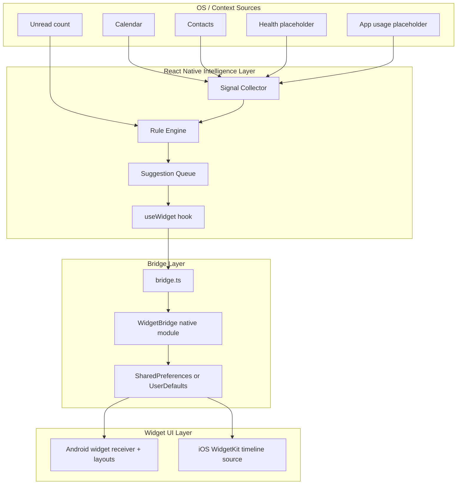
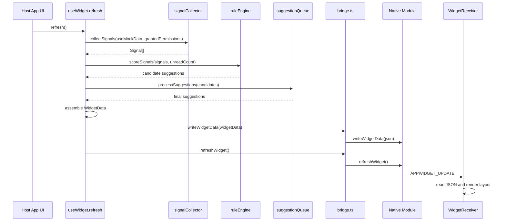

# Widget Intelligence
### Google At a Glance x Siri Suggestions

[](https://expo.dev)
[](https://typescriptlang.org)
[](https://kotlinlang.org)
[](https://developer.apple.com/swift/)

Zero-backend, on-device intelligence engine + native home-screen widget system.

The system reads local signals (calendar, contacts, health placeholders, app context), scores contextual suggestions on-device, serializes a shared `WidgetData` payload, and renders native widgets on Android (Jetpack Glance style via RemoteViews) and iOS (WidgetKit source).

---

## Repository Layout
This repository has two major areas:

- `plan/`: Design and planning documents.
- `widget-intelligence/`: Actual implementation (Expo app + native widget bridge + Android/iOS widget source).

Primary application code lives in:

- `widget-intelligence/src/engine/`
- `widget-intelligence/src/hooks/`
- `widget-intelligence/src/types/`
- `widget-intelligence/modules/widget-bridge/`
- `widget-intelligence/android-widget/`
- `widget-intelligence/ios-widget/`

---

## Scope and Constraints

### What this project is
- A host app + intelligence layer + native widgets.
- Local-only inference (rule engine), no required backend.

### What is deliverable today
- Android implementation can be compiled, installed, and tested.
- iOS WidgetKit code is present for review.

### Environment constraints
- On Windows without Apple Developer provisioning, iOS App Group/WidgetKit signing is not practically shippable.
- Android is the primary runtime target for APK validation.

---

## Architecture



---

## Data Pipeline (Detailed)
This section is the complete implementation pipeline from signal capture to widget render.

### Pipeline stages

| Stage | Input | Processing | Output | Primary files |
|---|---|---|---|---|
| 1. Trigger | App launch, pull-to-refresh, toggles, periodic refresh | `refresh()` starts orchestration | refresh cycle started | `widget-intelligence/src/hooks/useWidget.ts` |
| 2. Signal collection | Permission set + mock mode flag | Collect from mock generator or OS adapters, apply TTL cache checks | `Signal[]` | `widget-intelligence/src/engine/signalCollector.ts`, `widget-intelligence/src/engine/mockDataGenerator.ts`, `widget-intelligence/src/types/Signal.ts` |
| 3. Rule scoring | `Signal[]` + unread count | Apply deterministic rules, assign relevance score | Candidate `Suggestion[]` | `widget-intelligence/src/engine/ruleEngine.ts` |
| 4. Queueing and dedup | Candidate suggestions | Expiry filter, cooldown filter, threshold filter, sort, cap | Final `Suggestion[]` | `widget-intelligence/src/engine/suggestionQueue.ts` |
| 5. Payload assembly | Final suggestions + context signals | Build normalized widget snapshot | `WidgetData` object | `widget-intelligence/src/hooks/useWidget.ts`, `widget-intelligence/src/types/WidgetData.ts` |
| 6. Bridge write | `WidgetData` | JSON serialize and write to native storage | persisted JSON payload | `widget-intelligence/modules/widget-bridge/bridge.ts`, `widget-intelligence/modules/widget-bridge/android/WidgetBridgeModule.kt` |
| 7. Native refresh | Broadcast/update call | Widget receiver reloads payload and re-renders by size | Updated widget UI | `widget-intelligence/android-widget/WidgetReceiver.kt`, `widget-intelligence/android-widget/SmallWidget.kt`, `widget-intelligence/android-widget/MediumWidget.kt`, `widget-intelligence/android-widget/LargeWidget.kt` |
| 8. Background cycle | WorkManager periodic task | Trigger refresh every ~15 minutes (best effort) | recurring refresh | `widget-intelligence/android-widget/PeriodicRefreshWorker.kt` |

### End-to-end sequence



### Signal freshness and TTL behavior
Defined in `SIGNAL_TTL`.

- `calendar_event`: 5 min
- `step_count`: 30 min
- `sleep_duration`: 30 min
- `top_contact`: 60 min
- `app_usage`: 15 min
- `now_playing`: 5 min

### Suggestion filtering behavior

- Relevance threshold: `>= 0.45`
- Max surfaced suggestions: `3`
- Cooldown per suggestion ID: `4 hours`
- Expired suggestions are removed before ranking

---

## WidgetData Contract
Shared payload contract used by both platform widget layers.

Primary type definition:

- `widget-intelligence/src/types/WidgetData.ts`

Representative payload:

```json
{
  "updatedAt": 1760000000000,
  "unreadCount": 7,
  "messagePreview": {
    "sender": "alex",
    "snippet": "hey, are we still on for tonight?",
    "deepLink": "widget://chat/123"
  },
  "nextEvent": {
    "title": "team standup",
    "startsInMinutes": 25,
    "deepLink": "widget://meeting/evt_1"
  },
  "healthInsight": {
    "type": "sleep",
    "message": "5.5h of sleep last night"
  },
  "suggestions": [
    {
      "id": "suggestion-contacts-abc123",
      "message": "maybe check in with alex?",
      "relevanceScore": 0.6,
      "source": "contacts",
      "deepLinkAction": "widget://contact/alex",
      "expiresAt": 1760014400000
    }
  ]
}
```

---

## Rules Implemented

From `widget-intelligence/src/engine/ruleEngine.ts`:

- Event starts in `< 60 min` -> score `0.80`
- Event starts in `1-3 hours` -> score `0.50`
- Sleep `< 6h` -> score `0.70`
- Sleep `< 7h` + poor quality -> score `0.55`
- Top contact no interaction `>= 7 days` -> score `0.60`
- Top contact no interaction `>= 3 days` -> score `0.50`
- Steps `< 3000` after 8 PM -> score `0.55`
- Steps `< 1000` after noon -> score `0.50`
- Unread count `> 5` -> score `0.65`

Final ranking always sorts by score descending before capping.

---

## Permission and Fallback Model

- Permissions are tracked in persistent Zustand store.
- Denied/unavailable sources are omitted, not fatal.
- Engine continues with available signals only.
- Health source currently degrades gracefully in real mode unless a native health module is wired.
- Mock mode can be toggled for deterministic demo output.

Primary files:

- `widget-intelligence/src/store.ts`
- `widget-intelligence/src/hooks/usePermissions.ts`
- `widget-intelligence/app/onboarding/permissions.tsx`
- `widget-intelligence/app/settings.tsx`

---

## Build and Run

### Requirements

- Node.js `>= 20.19.4` (recommended; lower versions produce engine warnings and tooling issues)
- Android SDK installed
- EAS CLI available globally (or via `npx eas`)

### Install

```bash
cd widget-intelligence
npm install
```

### Project health checks

```bash
npx expo-doctor
```

### Local development

```bash
# start Metro
npm start

# if device cannot reach local 8081, use tunnel
npx expo start --tunnel
```

```bash
# run Android native build/install from local machine
npm run android
# or
npx expo run:android
```

### EAS cloud build

```bash
# development client APK/AAB
npx eas build --platform android --profile development

# preview build (standalone-like testing)
npx eas build --platform android --profile preview

# production
npx eas build --platform android --profile production
```

---

## Testing

```bash
cd widget-intelligence
npm test
```

Engine-focused suites live in:

- `widget-intelligence/__tests__/engine/ruleEngine.test.ts`
- `widget-intelligence/__tests__/engine/signalCollector.test.ts`
- `widget-intelligence/__tests__/engine/suggestionQueue.test.ts`

---

## Troubleshooting

### 1) `java.net.ConnectException ... /<ip>:8081`
Phone cannot reach Metro.

Fix:

```bash
npx expo start --tunnel
```

### 2) `SDK location not found`
Create or fix `android/local.properties`:

```properties
sdk.dir=D:/android_studio
```

### 3) `Return type mismatch: expected Any?, actual Unit` in `WidgetBridgeModule.kt`
The fix must be applied in source module file (because prebuild copies it):

- `widget-intelligence/modules/widget-bridge/android/WidgetBridgeModule.kt`

Then rerun prebuild and rebuild:

```bash
npx expo prebuild --platform android --no-install
npx eas build --platform android --profile development --clear-cache
```

### 4) `expo doctor` says local `eas-cli` should not be installed
Remove local `eas-cli` from project dependencies and use global/npx:

```bash
npx eas --version
```

### 5) Widget appears but cannot be added
Regenerate native files and reinstall app:

```bash
npx expo prebuild --platform android --clean
npx expo run:android
```

---

## iOS Note

iOS widget source exists in:

- `widget-intelligence/ios-widget/`
- `widget-intelligence/modules/widget-bridge/ios/WidgetBridgeModule.swift`

Building/signed distribution for iOS requires Apple Developer provisioning and a macOS signing workflow.

---

## Current Deliverables Checklist

- [x] TypeScript rule engine with deterministic local scoring
- [x] Suggestion queue with threshold, sorting, cooldown, expiry
- [x] Shared WidgetData contract and native bridge writes
- [x] Android widget receiver + small/medium/large widget rendering paths
- [x] Permission onboarding + settings + mock mode
- [x] Unit tests for core engine modules
- [x] EAS Android build pipeline
- [x] iOS widget source for review
