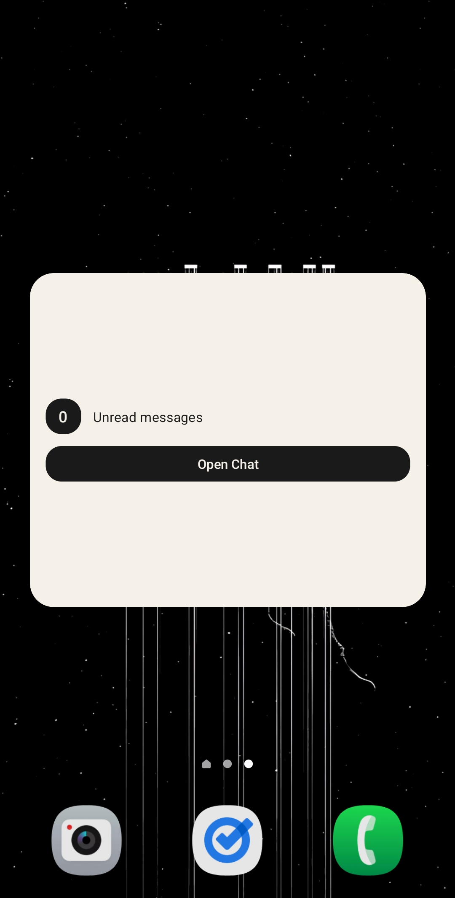
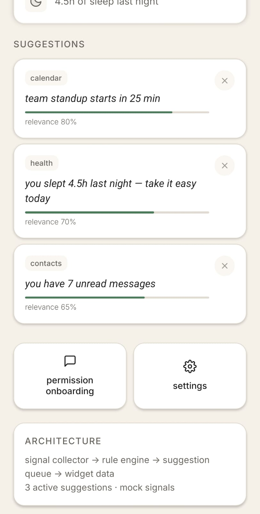
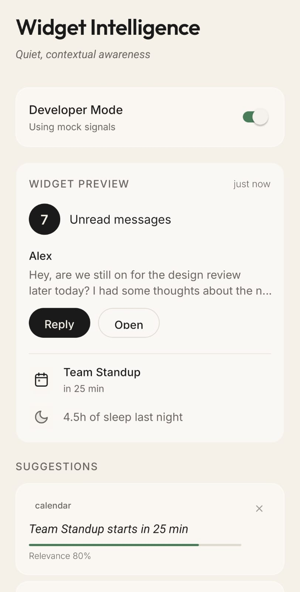
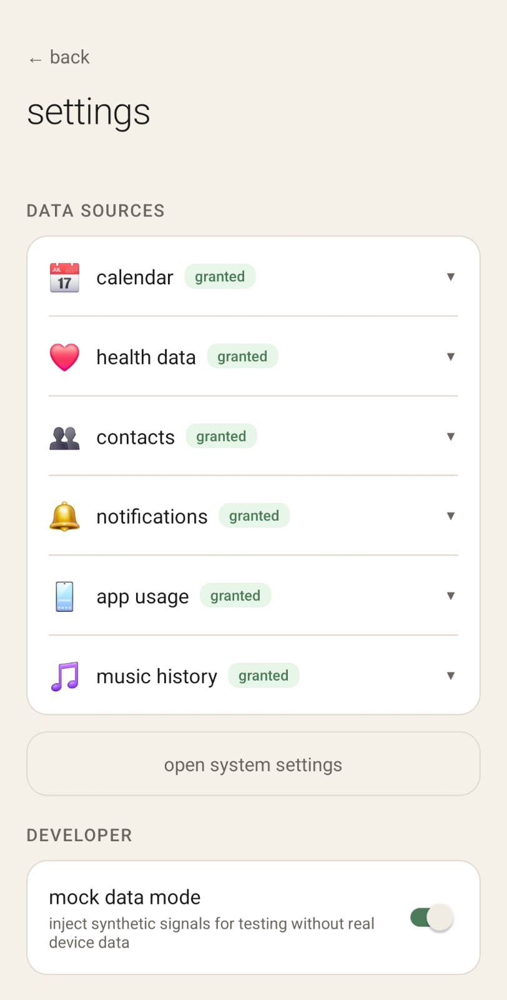
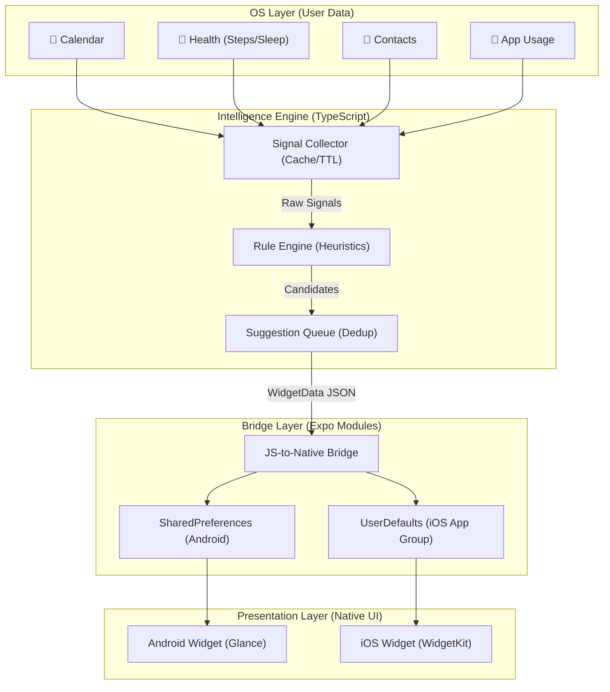
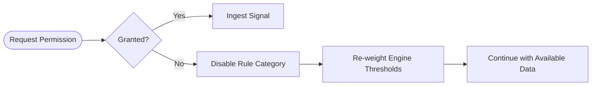

# ✧ Widget Intelligence
### Google At a Glance × Siri Suggestions

[](https://expo.dev)
[](https://typescriptlang.org)
[](https://kotlinlang.org)
[](https://developer.apple.com/swift/)

A zero-backend, on-device intelligence engine and home-screen widget system that surfaces quiet, contextual awareness through cross-app signal analysis.

---

## 📸 App Showcase

| Widget View | Onboarding & Permissions |
|:---:|:---:|
|  |  |

| Dashboard & Suggestions | Settings & Fallbacks |
|:---:|:---:|
|  |  |

---

## 🎯 Deliverables Completed
*Aligned with the core task evaluation scope:*
- [x] High-level architectural diagram
- [x] Low-level design (widget architecture, data pipeline, suggestion engine)
- [x] Working Android + iOS widget implementations
- [x] Native modules for cross-app intelligence
- [x] React Native hooks (e.g., `useWidget`, `useContextualSuggestions`)
- [x] Tests for native modules
- [x] Documentation

---

## 🤔 Assumptions & Reasoning

* **Why React Native (Expo) as Host?**: Provides a single-source-of-truth for the complex intelligence engine and scoring logic (TypeScript), while bridging gracefully to Native Jetpack Glance and WidgetKit for premium widget rendering.
* **Why Rule-Based On-Device Engine vs ML?**: For v1, a rule-based engine guarantees **100% data privacy** ("Zero-Backend"). Processing Health, Contacts, and Calendar data locally requires no network, consumes little battery, and avoids the massive GDPR/privacy friction of a cloud-based ML model.
* **Why "Warm Minimalism"?**: High context shouldn't mean high stress. We trade alarming "red notification dots" for calm, human-readable suggestions like *"maybe check in with alex?"*

---

## 🏗 System Architecture

The project consists of a React Native host app orchestrating the intelligence engine. It bridges finalized JSON state to native widget extensions via Shared Preferences / User Defaults.



---

## 🔄 End-to-End Flow & Implementation

How data moves from OS to Widget:
1. **App Open/Background Job**: The host React Native app wakes up.
2. **Collect**: The `SignalCollector` attempts to read native APIs (Calendar, Health, etc).
3. **Score**: The `RuleEngine` evaluates each signal against the Rulebook, assigning a `0.0 - 1.0` confidence score.
4. **Filter**: The `SuggestionQueue` culls anything below `0.45`, applies a 4-hour cooldown lock to prevent spam, and caps at the top 3 items.
5. **Bridge**: The JSON payload is serialized and sent to the Native Module bridge.
6. **Render**: The App Group data updates, pinging iOS `WidgetCenter.shared.reloadAllTimelines()` and Android `AppWidgetManager` to repaint the widgets with fresh data.

---

## 🔀 Logic for Real Implementation and iOS

While the project utilizes a mock-data setup for rapid iteration, transitioning to production Native OS signals uses the following logic:

### Android Real Implementation
* **Calendar**: Fetch via Android `CalendarContract` provider.
* **Health**: Integrating `Health Connect` API for Step counts and Sleep Sessions.
* **Widget Refresh**: Utilize `WorkManager` for a bounded ~15-minute background refresh task that wakes the JS engine, processes rules, and repaints `Glance`.

### iOS Real Implementation (WidgetKit)
* **Calendar / Health**: Utilize Apple's `EventKit` and `HealthKit` respectively.
* **Widget Refresh (TimelineProvider)**: iOS limits background app execution strictly.
  * Apple does not allow constant polling. Instead, we generate a **Timeline** of predicted widget states.
  * The React Native host updates `UserDefaults` (App Groups) whenever the main app is opened, or when triggered by a Silent Push Notification / Background Fetch.
  * The iOS Swift widget extension reads this shared `UserDefaults` to render the SwiftUI widget immediately when seen.

---

## 🛡️ Fallback & Permission UX

If an intelligent system relies on ubiquitous access, it must handle denial gracefully.



* **Progressive Onboarding**: Rather than requesting 5 scary permissions at startup, we ask contextually. We explain *why* before triggering the OS-level prompt.
* **Graceful Degradation**: If Calendar is denied, the engine does not flatline. It simply prunes Calendar rules from the tree and lowers the total threshold to rely on Health/Contacts.
* **Recovery**: Permanently denied permissions render a explicitly "Locked" state in the Settings page, allowing the user to tap and deep-link directly into OS Settings (`Linking.openSettings()`).

---

## 📡 Endpoints (Zero-Backend)

For version 1.0, the app dictates **Zero-Backend Endpoint Requirements**—all user data stays strictly on device for absolute privacy.

However, if extending to Cloud ML inference (and locally is insufficient), the system would require a single anonymized endpoint signature:

```http
POST https://ml.yourdomain.com/v1/intelligence/score
Content-Type: application/json

{
  "signals": [
    { "type": "STALE_CONTACT", "lastContactDays": 8 }
  ],
  "timeOfDay": "14:30"
}
```
*Note: Due to privacy UX, remote evaluation should be avoided unless explicitly opted into.*

---

## ⚖️ The Intelligence Rulebook

| Signal | Logic | Score | Source |
|:--- |:--- |:---:|:--- |
| **Event Proximity** | Calendar event starting in < 60 min | **0.80** | 📅 Calendar |
| **Event Upcoming** | Calendar event starting in 1-3 hours | **0.50** | 📅 Calendar |
| **Sleep Alert** | Sleep duration < 6 hours last night | **0.70** | 😴 Health |
| **Habit Gap** | Frequent contact not messaged in 7+ days | **0.60** | 👤 Contacts |
| **Step Alert** | Steps < 3000 detected after 8:00 PM | **0.55** | 🚶 Health |

---

## 📱 Widget Matrix

### Android (Jetpack Glance)
| Size | Design Goal | Key Content |
|:--- |:--- |:--- |
| **Small (2x2)** | Quick Catch-up | Unread count + Direct Message action |
| **Medium (4x2)** | Contextual Flow | Message sender/snippet + Reply/Open buttons |
| **Large (4x4)** | Dashboard | Full context: Message + Next Event + Health + Suggestion |

### iOS (WidgetKit SwiftUI)
| Family | Content Breakdown |
|:--- |:--- |
| **Small** | Circle unread count + simple status greeting |
| **Medium** | Split view: Messages (left) / Events & Suggestions (right) |
| **Large** | Complete vertical stack of all active signals |

---

## 🎨 Design System: Warm Minimalism

The UI feels human and organic, using cream surfaces and quiet typography.

| Usage | Color | Sample | HSL / Hex |
|:--- |:--- |:---:|:--- |
| **Surface** | Cream |  | `#F5F0E8` |
| **Primary Text** | Graphite |  | `#1A1A1A` |
| **Secondary Text**| Muted Umber |  | `#6B6560` |
| **Success/Score** | Sage |  | `#4A7C59` |

### Copy Principles
- **lowercase**: always lowercase, never shouting.
- **warmth**: "maybe check in with alex?" instead of "Contact Alex Reminder".

---

## 🚀 Deployment Steps

### Local Development Build
```bash
# 1. Install Dependencies
npm install --legacy-peer-deps

# 2. Run Tests
npm test

# 3. Android Native Run (Requires Simulator/Device)
npm run android
```

### Production Build & Delivery
**For Android (APK / AAB via Expo EAS)**
```bash
# 1. Login to EAS
eas login

# 2. Trigger Cloud Build for Android
npx eas-cli build --platform android --profile production
```

**For iOS (TestFlight / App Store)**
```bash
# (Requires macOS & Apple Developer Account)
npx eas-cli build --platform ios --profile production

# OR locally (if on macOS)
npx expo run:ios --configuration Release
```
