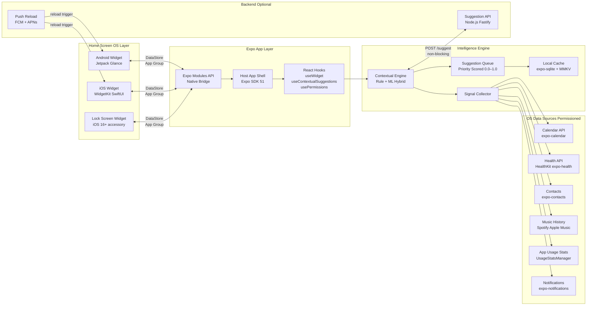
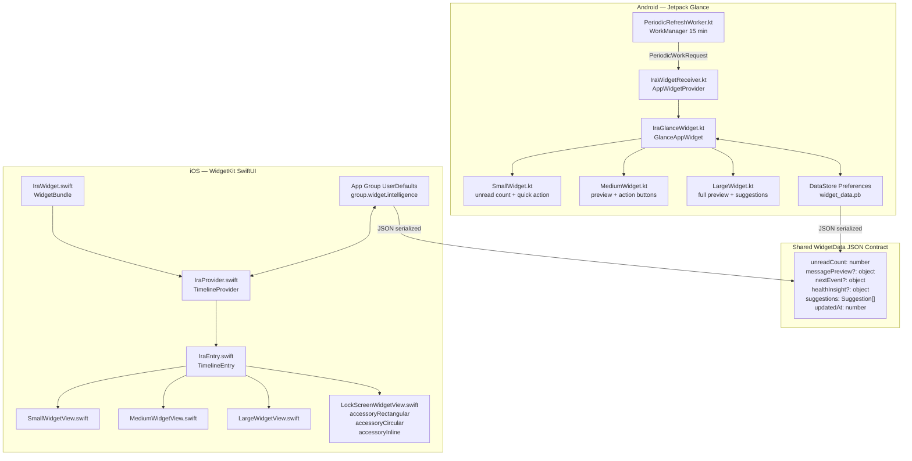
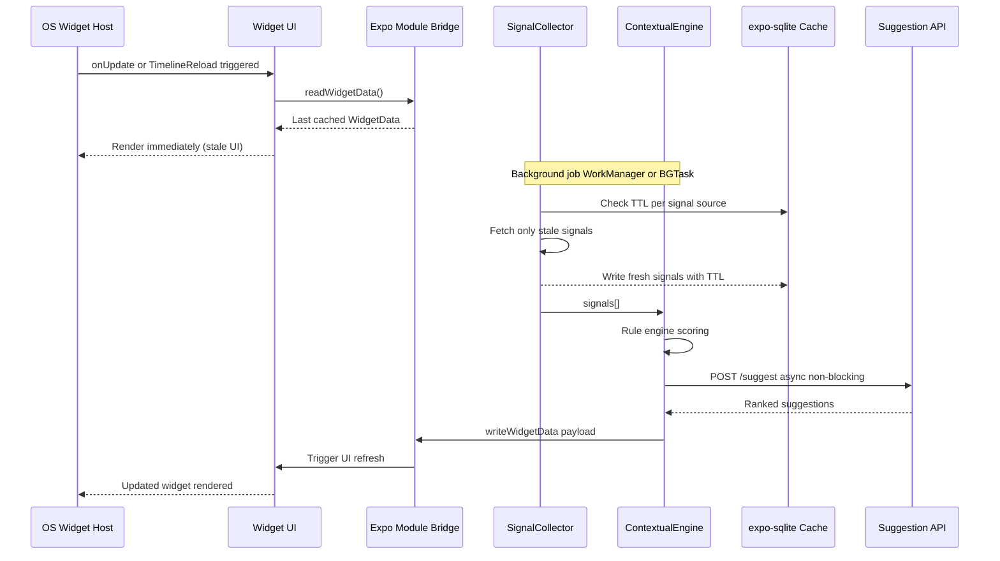
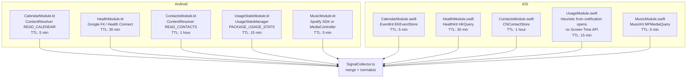
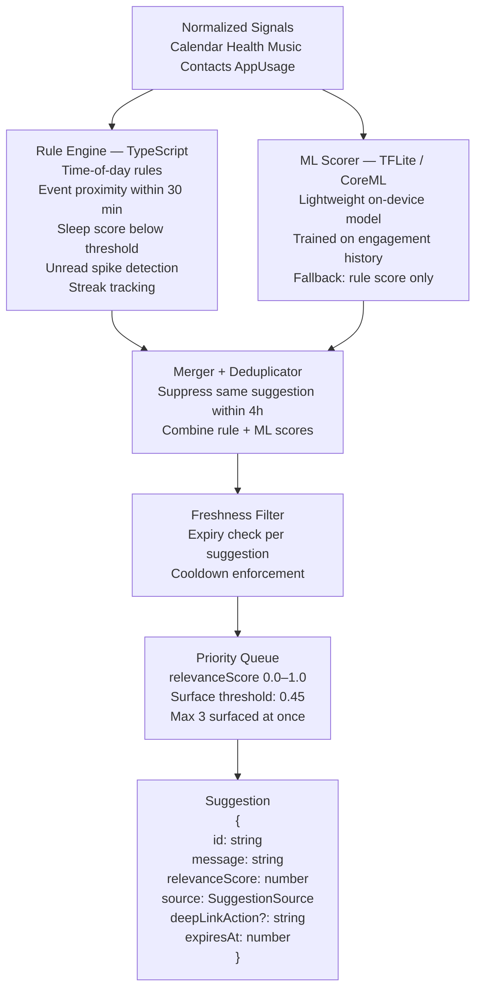
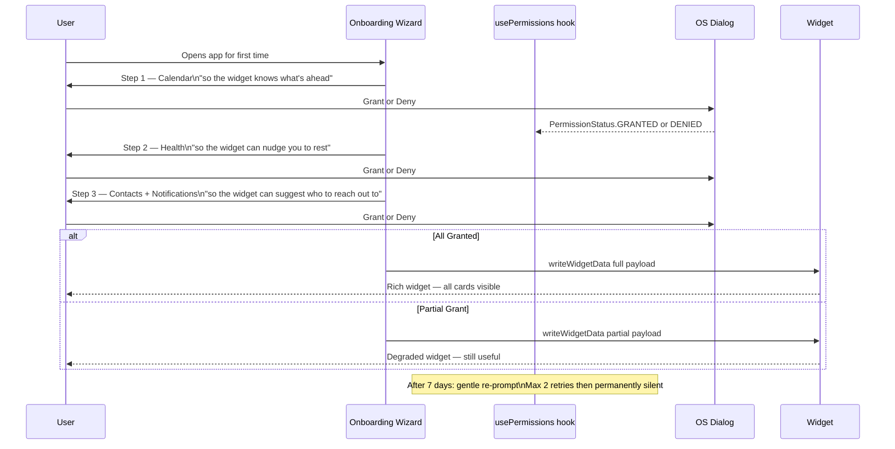

# Cross-App Intelligence & Home Screen Widget System
## Exhaustive Engineering Plan

> **Assignment:** Home Screen Widget + Intelligence Engine (Google At a Glance × Siri Suggestions)
> **Timeline:** 72 hours
> **Dev Environment:** Windows — Expo SDK 51 + EAS Build (cloud compilation for both platforms)
> **Design Style:** Warm minimalist — cream surfaces, organic typography, quiet intelligence

---

## 0. What We Are Building

This is **not a standalone app**. It is a widget system + intelligence layer that wraps around a host messaging/chat app. Think of the relationship like this:

```
Host App (chat / messaging)
  └── Widget Extension (home screen tile — this is what we build)
  └── Intelligence Engine (reads OS signals, ranks suggestions — this is what we build)
  └── Permission Onboarding (asks users for data access — this is what we build)
  └── Native Modules (reads Calendar, Health, Contacts from OS — this is what we build)
```

The host app is stubbed. The evaluators care about the widget, the engine, and the native integration — not the chat feature.

**Dev setup on Windows:**
```
Windows Machine
  └── eas build --platform android   →  Ubuntu cloud runner  →  .aab
  └── eas build --platform ios       →  Apple Silicon runner →  .ipa
  └── Android Emulator (local, Android Studio)
  └── iOS testing via TestFlight on physical device
```

---

## 1. High-Level Architecture



---

## 2. Low-Level Design

### 2.1 Widget Architecture



### 2.2 Data Pipeline — Stale While Revalidate



### 2.3 Signal Collection Per Source



### 2.4 Suggestion Engine



### 2.5 Permission Flow



---

## 3. Tech Stack

### 3.1 Core Framework

| Layer | Choice | Reason |
|---|---|---|
| App framework | Expo SDK 51 | Managed workflow, EAS integration, Windows-compatible |
| Language — app | TypeScript | Type safety across engine and hooks |
| Language — Android widget | Kotlin | Jetpack Glance requires Kotlin |
| Language — iOS widget | Swift | WidgetKit requires Swift |
| Build system | EAS Build | Cloud compiles both platforms from Windows |
| Native modules | Expo Modules API | Modern replacement for bare TurboModules |
| Navigation | Expo Router v3 | File-based typed routes |

### 3.2 Widget Packages

| Widget | Package |
|---|---|
| Android widget | `react-native-android-widget` — wraps Jetpack Glance |
| iOS widget | `react-native-widget-extension` — Swift extension via EAS |
| Widget data bridge | Custom Expo Module — writes JSON to DataStore / App Group |

### 3.3 Data & Permissions

| Concern | Package |
|---|---|
| Fast key-value | `react-native-mmkv` |
| SQLite cache | `expo-sqlite` v14 |
| Calendar | `expo-calendar` |
| Health | `expo-health` (Android) + HealthKit custom module (iOS) |
| Contacts | `expo-contacts` |
| Notifications | `expo-notifications` |
| Permissions | `react-native-permissions` |

### 3.4 Intelligence Engine

| Component | Choice |
|---|---|
| Rule engine | Pure TypeScript — zero runtime deps |
| ML scorer | `@tensorflow/tfjs-react-native` with TFLite delegate |
| Model training | Python scikit-learn → ONNX → TFLite + CoreML export |
| Signal cache | `expo-sqlite` with per-source TTL |

### 3.5 Networking & State

| Concern | Package |
|---|---|
| HTTP | `axios` |
| Server state | `@tanstack/react-query` v5 |
| Global state | `zustand` |
| Push reload | `expo-notifications` + FCM + APNs |

### 3.6 Backend (Minimal)

| Service | Stack |
|---|---|
| Suggestion API | Node.js + Fastify |
| Push notifications | `expo-server-sdk-node` → FCM + APNs |
| Auth | JWT + device ID |
| Hosting | Vercel (stateless API routes) |

---

## 4. Functional Requirements

### Part A — Widgets

**Android (Jetpack Glance)**

- [ ] **Small** — unread message count + single quick-chat tap zone
- [ ] **Medium** — unread count + last message preview (2 lines) + Reply and Open action buttons
- [ ] **Large** — message preview + 3 quick actions + 1 contextual suggestion card
- [ ] Dark mode via `GlanceTheme` + `DynamicColorScheme`
- [ ] Deep links: `widget://chat`, `widget://meeting/{id}`, `widget://contact/{id}`
- [ ] Each action button is an independent tap zone with its own `PendingIntent`
- [ ] WorkManager `PeriodicWorkRequest` — 15 min interval, `BATTERY_NOT_LOW` constraint
- [ ] Shimmer skeleton while refreshing (Compose animation, optional)

**iOS (WidgetKit + SwiftUI)**

- [ ] **Small** — unread count + greeting chip
- [ ] **Medium** — unread + next calendar event + one suggestion
- [ ] **Large** — full dashboard: messages, next event, health insight, suggestion
- [ ] **Lock screen** — `accessoryRectangular` (next event), `accessoryCircular` (unread count), `accessoryInline` (suggestion text)
- [ ] Deep link per zone via `.widgetURL()` and `Link(destination:)`
- [ ] Timeline phases: morning 6am / afternoon 12pm / evening 6pm / night 10pm
- [ ] Push-triggered reload: `WidgetCenter.shared.reloadAllTimelines()`
- [ ] Shared data via App Group: `group.widget.intelligence`

### Part B — Cross-App Intelligence Layer

- [ ] Calendar: next 5 events in 24-hour window
- [ ] Health: today's step count, last night's sleep duration
- [ ] Contacts: top 5 by interaction frequency (call + message combined)
- [ ] App usage: top 3 categories by daily screen time (Android only, iOS heuristic)
- [ ] Music: currently playing or last played track + genre
- [ ] Installed apps: category classification (Android `PackageManager`, iOS URL scheme probing)
- [ ] Each source cached in `expo-sqlite` with independent TTL
- [ ] Denied permission → that signal is omitted, engine continues with remaining signals
- [ ] All data stays on device — nothing sent to backend without explicit opt-in

### Part C — Suggestion Engine

- [ ] Minimum 1 suggestion per refresh cycle, maximum 3 surfaced at once
- [ ] Full suggestion schema: `{ id, message, relevanceScore, source, deepLinkAction?, expiresAt }`
- [ ] Suggestion types: conversation starter, event reminder, wellness nudge, timely prompt, ambient presence moment
- [ ] 4-hour cooldown per unique suggestion ID
- [ ] Relevance threshold: 0.45 minimum to surface to widget
- [ ] Rule engine covers: time of day, event within 30 min, steps below 3000 by 8pm, unread spike over 5, contact not messaged in 7 days
- [ ] ML scorer runs on-device as enhancement layer over rule scores

### Part D — Permission UX

- [ ] 3-step progressive onboarding — one permission group per screen, never two dialogs at once
- [ ] Warm justification copy per permission explaining the benefit in plain language
- [ ] Widget renders in degraded mode if any permissions denied — never blank, never crashes
- [ ] Re-request after 7 days, max 2 retries per permission, then permanently silent
- [ ] Settings screen: toggle per data source, status badge (granted / denied / not set), expandable "why we need this" section, direct link to system settings

---

## 5. Non-Functional Requirements

| Requirement | Target |
|---|---|
| Widget render (perceived) | < 200ms via stale-while-revalidate |
| Suggestion latency (local cache) | < 100ms |
| EAS Android build time | 5–8 min |
| EAS iOS build time | 10–15 min |
| Battery impact | < 0.5% per day |
| Offline | Full functionality from cache |
| Crash-free | >= 99.5% |
| Accessibility | TalkBack (Android) + VoiceOver (iOS) content descriptions on all tap zones |
| Min Android | API 26 (Android 8.0) |
| Min iOS | 16.0 |
| Privacy | No PII leaves device without explicit consent |

---

## 6. File & Module Structure

```
widget-intelligence/
├── app/                                   # Expo Router screens
│   ├── (tabs)/
│   │   ├── index.tsx                      # Host app home (stubbed)
│   │   └── settings.tsx                   # Permission settings screen
│   └── onboarding/
│       └── permissions.tsx                # 3-step permission wizard
│
├── src/
│   ├── hooks/
│   │   ├── useWidget.ts                   # Read/write/refresh widget data
│   │   ├── useContextualSuggestions.ts    # Fetch ranked suggestions
│   │   ├── usePermissions.ts              # Manage all permission states
│   │   └── useCrossAppData.ts             # Unified signal access
│   │
│   ├── engine/
│   │   ├── signalCollector.ts             # Gather + normalize all signals
│   │   ├── ruleEngine.ts                  # Pure TS rule scoring
│   │   ├── mlScorer.ts                    # TFLite / CoreML wrapper
│   │   ├── suggestionQueue.ts             # Priority queue + dedup + TTL
│   │   └── preferenceModel.ts             # User preference tracking
│   │
│   ├── native/
│   │   ├── CalendarBridge.ts
│   │   ├── HealthBridge.ts
│   │   ├── ContactsBridge.ts
│   │   └── UsageStatsBridge.ts
│   │
│   └── types/
│       ├── WidgetData.ts
│       ├── Suggestion.ts
│       └── Signal.ts
│
├── modules/
│   └── widget-bridge/                     # Custom Expo Module
│       ├── index.ts
│       ├── android/
│       │   └── WidgetBridgeModule.kt      # Writes to DataStore
│       └── ios/
│           └── WidgetBridgeModule.swift   # Writes to App Group
│
├── android-widget/                        # Jetpack Glance source
│   ├── WidgetReceiver.kt
│   ├── GlanceWidget.kt
│   ├── SmallWidget.kt
│   ├── MediumWidget.kt
│   ├── LargeWidget.kt
│   └── PeriodicRefreshWorker.kt
│
├── ios-widget/                            # SwiftUI WidgetKit extension
│   ├── WidgetBundle.swift
│   ├── TimelineProvider.swift
│   ├── TimelineEntry.swift
│   ├── SmallWidgetView.swift
│   ├── MediumWidgetView.swift
│   ├── LargeWidgetView.swift
│   └── LockScreenWidgetView.swift
│
├── __tests__/
│   ├── engine/
│   │   ├── ruleEngine.test.ts
│   │   ├── suggestionQueue.test.ts
│   │   └── signalCollector.test.ts
│   └── hooks/
│       ├── useWidget.test.ts
│       └── useContextualSuggestions.test.ts
│
├── eas.json
├── app.config.ts
└── package.json
```

---

## 7. API Contracts

### 7.1 WidgetData Schema

```typescript
interface WidgetData {
  updatedAt: number;              // Unix ms
  unreadCount: number;
  messagePreview?: {
    sender: string;
    snippet: string;              // max 120 chars
    deepLink: string;             // widget://chat/{threadId}
  };
  nextEvent?: {
    title: string;
    startsInMinutes: number;
    deepLink: string;
  };
  healthInsight?: {
    type: 'sleep' | 'steps' | 'streak';
    message: string;              // max 60 chars
  };
  suggestions: Suggestion[];      // max 3 items
}

interface Suggestion {
  id: string;
  message: string;                // max 60 chars, always lowercase
  relevanceScore: number;         // 0.0 – 1.0, surface if >= 0.45
  source: SuggestionSource;
  deepLinkAction?: string;
  expiresAt: number;              // Unix ms
}

type SuggestionSource =
  | 'calendar'
  | 'health'
  | 'contacts'
  | 'music'
  | 'appUsage'
  | 'backend';

interface Signal {
  type: SignalType;
  value: unknown;
  capturedAt: number;
  ttlMs: number;
}

type SignalType =
  | 'calendar_event'
  | 'step_count'
  | 'sleep_duration'
  | 'top_contact'
  | 'app_usage'
  | 'now_playing';
```

### 7.2 React Native Hooks Interface

```typescript
// Read and write widget data, trigger background refresh
const useWidget = () => ({
  widgetData: WidgetData | null,
  isLoading: boolean,
  refresh: () => Promise<void>,
  updateWidget: (data: Partial<WidgetData>) => void,
});

// Get ranked suggestions, dismiss individual ones
const useContextualSuggestions = (opts?: {
  minScore?: number;    // default: 0.45
  limit?: number;       // default: 3
}) => ({
  suggestions: Suggestion[],
  isLoading: boolean,
  dismiss: (id: string) => void,
  refetch: () => void,
});

// Manage permission state across all sources
const usePermissions = () => ({
  permissions: Record<PermissionKey, PermissionStatus>,
  request: (key: PermissionKey) => Promise<PermissionStatus>,
  openSettings: () => void,
  hasMinimumPermissions: boolean,    // true if calendar granted
});

type PermissionKey =
  | 'calendar'
  | 'health'
  | 'contacts'
  | 'notifications'
  | 'appUsage'
  | 'music';
```

### 7.3 Suggestion Backend API (Optional Enhancement)

```
POST /api/v1/suggest
Authorization: Bearer <device_jwt>

{
  "signals": Signal[],
  "platform": "android" | "ios",
  "timestamp": number
}

→ 200
{
  "suggestions": Suggestion[],
  "nextRefreshMs": 900000
}
```

---

## 8. EAS Build Setup

### `eas.json`

```json
{
  "cli": { "version": ">= 10.0.0" },
  "build": {
    "development": {
      "developmentClient": true,
      "distribution": "internal",
      "android": { "buildType": "apk" },
      "ios": { "simulator": false }
    },
    "preview": {
      "distribution": "internal",
      "android": { "buildType": "apk" },
      "ios": { "distribution": "internal" }
    },
    "production": {
      "android": { "buildType": "app-bundle" },
      "ios": { "distribution": "store" }
    }
  }
}
```

### `app.config.ts`

```typescript
export default {
  expo: {
    name: "Widget Intelligence",
    slug: "widget-intelligence",
    version: "1.0.0",
    ios: {
      bundleIdentifier: "com.widget.intelligence",
      entitlements: {
        "com.apple.security.application-groups": [
          "group.widget.intelligence"
        ]
      }
    },
    android: {
      package: "com.widget.intelligence",
      permissions: [
        "READ_CALENDAR",
        "READ_CONTACTS",
        "PACKAGE_USAGE_STATS",
        "ACTIVITY_RECOGNITION"
      ]
    },
    plugins: [
      "expo-calendar",
      "expo-contacts",
      "expo-health",
      "expo-notifications",
      ["react-native-widget-extension", {
        "targetName": "IntelligenceWidget",
        "src": "./ios-widget"
      }],
      ["react-native-android-widget", {
        "widgets": [
          { "name": "SmallWidget",  "label": "Intelligence — Small"  },
          { "name": "MediumWidget", "label": "Intelligence — Medium" },
          { "name": "LargeWidget",  "label": "Intelligence — Large"  }
        ]
      }]
    ]
  }
};
```

### Build Commands (Windows terminal)

```bash
# Setup
npm install -g eas-cli
eas login && eas build:configure
npx expo prebuild

# Dev builds
eas build --platform android --profile development   # → download .apk, sideload
eas build --platform ios --profile development       # → TestFlight → device

# Production
eas build --platform all --profile production
```

---

## 9. 72-Hour Sprint Timeline

```mermaid
gantt
  title Widget Intelligence — 72hr Sprint
  dateFormat HH
  axisFormat %Hh

  section Setup 0 to 8h
  Expo init + EAS config + app.config.ts  :a1, 00, 2h
  Type definitions all schemas            :a2, after a1, 2h
  Custom Expo Module scaffold             :a3, after a2, 2h
  First Android dev EAS build baseline   :a4, after a3, 2h

  section Android Widget 8 to 24h
  SmallWidget Jetpack Glance              :b1, 08, 3h
  MediumWidget Jetpack Glance             :b2, after b1, 3h
  LargeWidget Jetpack Glance              :b3, after b2, 3h
  WorkManager refresh + DataStore         :b4, after b3, 3h
  Dark mode + deep links + tap zones      :b5, after b4, 4h

  section iOS Widget 24 to 40h
  TimelineProvider + Entry models         :c1, 24, 3h
  Small + Lock screen SwiftUI             :c2, after c1, 3h
  Medium + Large SwiftUI                  :c3, after c2, 3h
  App Group bridge + timeline phases      :c4, after c3, 3h
  EAS iOS build + TestFlight validation   :c5, after c4, 4h

  section Intelligence Engine 40 to 56h
  SignalCollector all 6 sources           :d1, 40, 4h
  Rule engine pure TypeScript             :d2, after d1, 4h
  Suggestion queue + dedup + cooldown     :d3, after d2, 4h
  ML scorer TFLite CoreML integration     :d4, after d3, 4h

  section Hooks + Permission UX 56 to 66h
  useWidget + useContextualSuggestions    :e1, 56, 3h
  usePermissions + re-request logic       :e2, after e1, 2h
  Permission onboarding 3-step wizard     :e3, after e2, 3h
  Permission settings screen              :e4, after e3, 2h

  section Tests + Docs 66 to 72h
  Jest unit tests engine and hooks        :f1, 66, 3h
  Production EAS builds both platforms    :f2, after f1, 2h
  README + architecture docs              :f3, after f2, 1h
```

---

## 10. Testing Strategy

### Unit Tests — Jest

| Module | What to test |
|---|---|
| `ruleEngine.ts` | All rule conditions, edge cases, time boundaries |
| `suggestionQueue.ts` | Priority ordering, 4h dedup, TTL expiry, score threshold |
| `signalCollector.ts` | Cache hit/miss, TTL per source, denied permission fallback |
| `useWidget` | Loading, refresh, stale data, updateWidget |
| `useContextualSuggestions` | Score filter, dismiss, empty state, refetch |
| `usePermissions` | All status states, re-request cooldown, minimum permission check |

### Android Native Tests — JUnit

| Test | Scope |
|---|---|
| `WidgetReceiverTest` | onUpdate triggers DataStore write correctly |
| `PeriodicRefreshWorkerTest` | WorkManager constraints, execution |
| `CalendarModuleTest` | Event parsing, denied permission fallback |
| `UsageStatsModuleTest` | Mock usage data, category classification |

### iOS Tests — XCTest (via EAS)

| Test | Scope |
|---|---|
| `TimelineProviderTests` | Entry generation, phase transitions |
| `TimelineEntryTests` | Serialization to App Group |
| `HealthModuleTests` | Mock HKQuery, HealthKit denied fallback |
| `CalendarModuleTests` | 24h window filter, empty state |

### Integration Tests

- Widget renders in all 3 sizes on Android Emulator without crash
- Deep links resolve: `widget://chat` opens host app correctly
- Suggestion visible within 200ms (stale-while-revalidate verified)
- Offline: widget renders cached data with staleness label
- EAS build passes for both platforms (required gate before submission)

---

## 11. Design Style

Warm minimalist — inspired by the quiet, human-first aesthetic of modern AI interfaces.

### Color Tokens

| Token | Light Mode | Dark Mode |
|---|---|---|
| `surface` | `#F5F0E8` warm cream | `#1C1A18` warm dark |
| `surface-card` | `#FFFFFF` | `#2A2723` |
| `text-primary` | `#1A1A1A` | `#F0EBE1` |
| `text-secondary` | `#6B6560` | `#9A948D` |
| `accent-pill-bg` | `#1A1A1A` | `#F0EBE1` |
| `accent-pill-text` | `#F5F0E8` | `#1A1A1A` |
| `border` | `#E0DAD0` | `#3A3733` |
| `granted` | `#4A7C59` muted green | same |
| `denied` | `#C17A3A` muted amber | same |

### Typography

| Use | Android | iOS | Weight |
|---|---|---|---|
| Unread count | Roboto Flex | SF Pro Rounded | 600 |
| Message preview | Roboto | SF Pro Text | 400 |
| Suggestion message | Roboto | SF Pro Text | 400 italic |
| Timestamp | Roboto | SF Pro Text | 300 |
| Action button | Roboto Medium | SF Pro Text | 500 |

### Widget Layout Rules

- Border radius: 16dp (card) / 24dp (pill buttons)
- Internal padding: 16dp all sides
- Action buttons: pill shape, 36dp height, full-width on small, inline on medium+
- Suggestion chip: cream background, 1dp border, 12dp border radius, lowercase text
- Divider: 1dp `border` color, 8dp margin top and bottom
- No drop shadows — flat, warm surfaces only

### Copy Principles

- Always lowercase ("you have 3 unread messages" not "You Have 3 Unread Messages")
- No exclamation marks anywhere
- Suggestion messages 60 chars maximum
- Warm but not performative ("maybe check in with alex?" not "Don't forget to message Alex!")
- Timestamps relative ("2 min ago", "in 20 min") not absolute

---

## 12. Risk Register

| Risk | Likelihood | Impact | Mitigation |
|---|---|---|---|
| EAS iOS provisioning failure | Medium | High | Set up Apple Developer account + EAS credentials Day 0 |
| iOS Screen Time API restricted by Apple | High | Medium | Heuristic fallback: infer usage from notification open frequency |
| HealthKit permissions denied by user | Medium | Low | Health section simply hidden from widget — no error state |
| WorkManager timing imprecise on Android | Medium | Low | Accept OS-approximated timing; push notification as exact-trigger fallback |
| ML model accuracy poor at v1 | Medium | Medium | Ship rule engine as primary; ML is additive enhancement only |
| `react-native-widget-extension` iOS compatibility issue | Medium | High | Pin to tested version; validate on first EAS build Day 0–1 |
| App Store review flags cross-app data | High | High | Privacy nutrition labels for every data type; on-device processing only |

---

## 13. Quick-Start Commands (Windows)

```bash
# 1. Create project
npx create-expo-app widget-intelligence --template blank-typescript
cd widget-intelligence

# 2. Install dependencies
npm install zustand @tanstack/react-query axios
npm install react-native-mmkv expo-sqlite
npm install expo-calendar expo-contacts expo-health expo-notifications
npm install react-native-android-widget react-native-widget-extension
npm install react-native-permissions
npm install @tensorflow/tfjs @tensorflow/tfjs-react-native

# 3. EAS setup
npm install -g eas-cli
eas login
eas build:configure

# 4. Generate native folders
npx expo prebuild

# 5. Android dev build — sideload to Android Emulator
eas build --platform android --profile development

# 6. iOS dev build — requires Apple Developer account
eas build --platform ios --profile development
# → upload .ipa to TestFlight → install on physical iPhone

# 7. Tests
npx jest --watchAll
```

---

*Document version: 3.0 — Generic widget system assignment, Rumik AI design style*