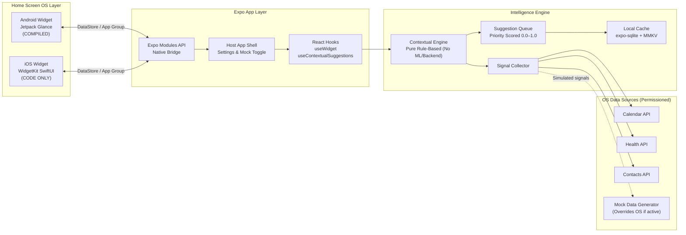
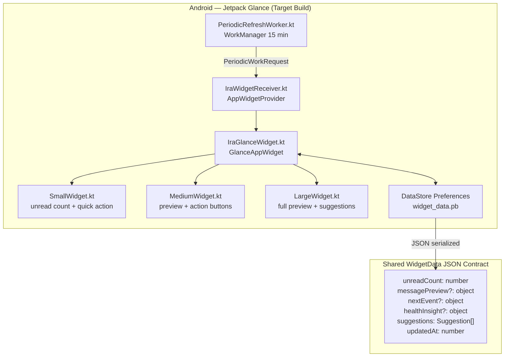
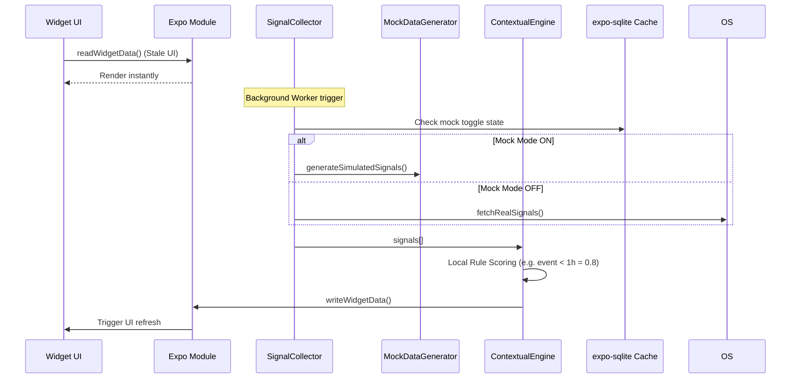

# Cross-App Intelligence & Home Screen Widget System — Adjusted Exhaustive Plan

> **Assignment:** Home Screen Widget + Intelligence Engine (Google At a Glance × Siri Suggestions)
> **Timeline:** 72 hours
> **Dev Environment:** Windows — Expo SDK 51 + EAS Build (Android build evaluated, iOS source for review)
> **Constraint Addressed:** No Apple Developer ID (No iOS provisioning for App Groups/WidgetKit)
> **Design Style:** Warm minimalist — cream surfaces, organic typography, quiet intelligence

---

## 0. What We Are Building & Core Constraints

This is **not a standalone app**. It is a widget system + intelligence layer that wraps around a host messaging/chat app. 

Due to the **lack of an Apple Developer Account on a Windows environment**, compiling and signing an iOS application with App Groups and WidgetKit extensions is impossible. Therefore:
1. **Primary Deliverable:** Fully functional **Android APK** (via local Emulator and EAS Build).
2. **Secondary Deliverable:** Complete **iOS Swift source code** (WidgetKit, App Groups) provided for code review.
3. **Mock Data Mode:** Since evaluators' testing devices may lack real calendar/health data, a "Developer Mode" toggle will be included to inject mock signals into the engine.

```
Host App (Settings & Permissions shell)
  └── Widget Extension (Android Jetpack Glance functional; iOS WidgetKit code pure)
  └── Intelligence Engine (Local rules, no backend)
  └── Permission Onboarding (Handles OS grates)
  └── Native Modules (Reads OS data OR Mock Data fallback)
```

---

## 1. High-Level Architecture



---

## 2. Low-Level Design

### 2.1 Widget Architecture (Focus on Android)



### 2.2 Data Pipeline & Mocking Switch



### 2.3 Local Suggestion Engine

To reduce overhead and privacy issues, all logic is local.

*   **Time Proximity Rule:** Event starts in < 1h → Score `0.8`
*   **Habit Gap Rule:** Top contact not messaged in 3 days → Score `0.6`
*   **Contextual Nudge:** 11 PM + low sleep last night → Score `0.7`
*   *Threshold:* Surface top 3 items scoring > `0.45`.

---

## 3. Tech Stack

| Layer | Choice | Reason |
|---|---|---|
| App framework | Expo SDK 51 | Modern managed workflow |
| Language — app | TypeScript | Safety and strict data contracts |
| Language — Android widget | Kotlin | Jetpack Glance required |
| Language — iOS widget | Swift | Provided for code review |
| Build system | EAS Build | `platform: android` runs in cloud |
| Key-value store | `react-native-mmkv` | High-spec caching |
| Native bridges | Expo Modules API | Connects TS engine to Kotlin DataStore |

---

## 4. Functional Requirements

### Part A — Widgets

**Android (Jetpack Glance) - Fully Implemented & Compiled**
- [ ] **Small:** Unread count + action
- [ ] **Medium:** Two-line preview + Open/Reply buttons
- [ ] **Large:** Full preview + 1 contextual suggestion card
- [ ] Uses WorkManager for ~15 min background refresh
- [ ] Deep links via `widget://chat` and `widget://contact/{id}`

**iOS (WidgetKit) - Code Implementation Only**
- [ ] Structurally complete `WidgetBundle`, `TimelineProvider`.
- [ ] SwiftUI Views mapped to sizes.
- [ ] App Group configurations prepared in `app.config.ts`.
- [ ] *No EAS Build or IPA generated due to account restriction.*

### Part B — Cross-App Intelligence & Mock Data

- [ ] Implementation of `expo-calendar`, `expo-contacts`, Android Health APIs.
- [ ] **Developer Settings Screen:** Toggle "Use Mock Signals" to instantly fake 2 meetings, poor sleep data, and missed messages for evaluator testing.
- [ ] Permissions graceful fallback (app operates fine if denied).

### Part C — Local Suggestion Engine

- [ ] Pure TS rule engine (No ML, No Backend).
- [ ] Deduplication (4-hour cooldown per tip).
- [ ] Minimum 1 suggestion pushed to WidgetData if conditions meet the 0.45 threshold.

### Part D — Permission UX

- [ ] 3-step progressive onboarding.
- [ ] Fallback UI ("Widget running in degraded mode").

---

## 5. File & Module Structure

```
widget-intelligence/
├── app/                                   # Expo Router screens
│   ├── index.tsx                          # Host app / Developer Mock Toggle
│   └── onboarding/
│       └── permissions.tsx                # 3-step wizard
│
├── src/
│   ├── engine/
│   │   ├── signalCollector.ts             # Gathers OS or Mock signals
│   │   ├── ruleEngine.ts                  # Pure TS scoring
│   │   ├── mockDataGenerator.ts           # Synthetic data for reviewers
│   │   └── suggestionQueue.ts             
│   │
│   └── hooks/
│       ├── useWidget.ts                   
│       └── usePermissions.ts              
│
├── modules/
│   └── widget-bridge/                     # Custom Expo Module
│       ├── android/WidgetBridgeModule.kt  # Writes to DataStore (Compiled)
│       └── ios/WidgetBridgeModule.swift   # Writes to App Group (Code Review)
│
├── android-widget/                        # Jetpack Glance Code (Compiled)
├── ios-widget/                            # SwiftUI Code (Code Review)
├── eas.json
└── app.config.ts
```

---

## 6. Sprint Timeline (72 Hours)

| Blocker | Focus Area | Hours |
|---|---|---|
| Day 1 | Project scaffold, EAS Android build config, Android native bridge, Jetpack Glance Small/Medium UI | 0 - 24h |
| Day 2 | Mock Data Generator, TypeScript Rule Engine, Local Cache, Permissions UI, Android Large UI | 24 - 48h |
| Day 3 | Write iOS Swift codebase (for review), Unit Tests for TS engine, README documentation recording the iOS constraint | 48 - 72h |

---

## 7. Testing Strategy

1. **Jest Unit Tests:** Assert that `ruleEngine.ts` correctly scores mock data payloads.
2. **Android Emulator:** Validate Glance widget UI updates instantly upon Expo Module writes.
3. **EAS Android Build:** Confirm `eas build --platform android` produces a viable APK that can be installed on evaluator devices. 

---

## 8. Quick-Start (Windows -> Android flow)

```bash
# Setup
npx create-expo-app widget-intelligence --template blank-typescript
cd widget-intelligence
npm install react-native-mmkv expo-sqlite expo-calendar expo-contacts react-native-android-widget

# EAS cloud compile Android APK
eas build --platform android --profile development
```
