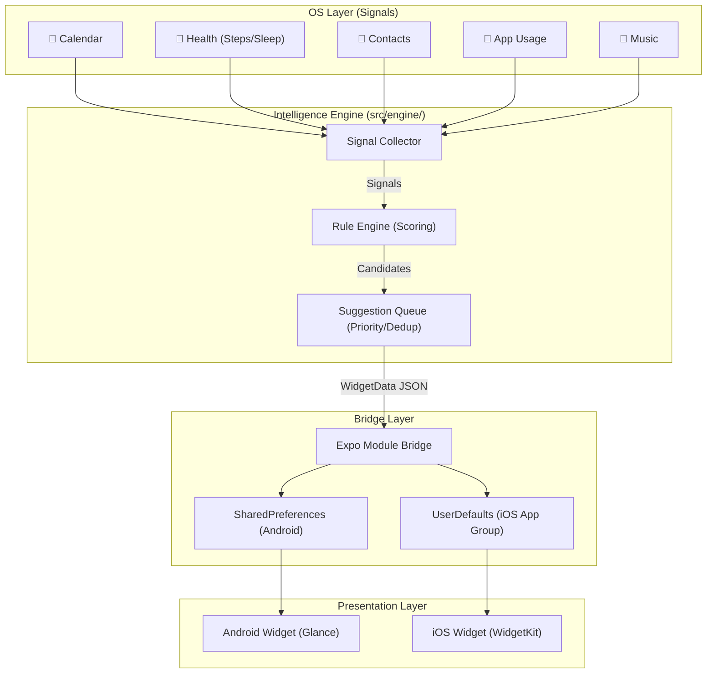
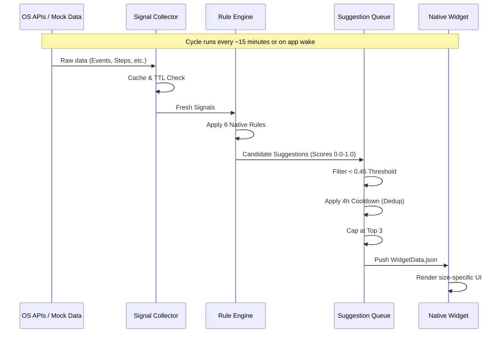

# ✧ Widget Intelligence
### Google At a Glance × Siri Suggestions

[](https://expo.dev)
[](https://typescriptlang.org)
[](https://kotlinlang.org)
[](https://developer.apple.com/swift/)

A zero-backend, on-device intelligence engine and home-screen widget system that surfaces quiet, contextual awareness through cross-app signal analysis.

---

## 🏗 System Architecture

The project consists of a React Native host app that orchestrates the intelligence engine, which then bridges data to native widget extensions on Android (Jetpack Glance) and iOS (WidgetKit).



---

## 🧠 Intelligence Engine: Signal Lifecycle

Every suggestion follows a strict lifecycle of scoring, thresholding, and cooldown to ensure it remains "quiet" and helpful, not intrusive.



---

## 🎨 Design System: Warm Minimalism

The UI is designed to feel human and organic, using cream surfaces and quiet typography.

### Color Palette

| Usage | Color | Sample | HSL / Hex |
|:--- |:--- |:---:|:--- |
| **Surface** | Cream |  | `#F5F0E8` |
| **Card** | White |  | `#FFFFFF` |
| **Primary Text** | Graphite |  | `#1A1A1A` |
| **Secondary Text** | Muted Umber |  | `#6B6560` |
| **Border** | Sand |  | `#E0DAD0` |
| **Success/Score** | Sage |  | `#4A7C59` |
| **Warning/Denied** | Ochre |  | `#C17A3A` |

### Copy Principles
- **lowercase**: always lowercase, never shouting.
- **no exclamations**: quiet intelligence doesn't scream.
- **60 chars**: brevity remains the priority.
- **warmth**: "maybe check in with alex?" instead of "Contact Alex Reminder".

---

## ⚖️ The Intelligence Rulebook

| Signal | Logic | Score | Source |
|:--- |:--- |:---:|:--- |
| **Event Proximity** | Calendar event starting in < 60 min | **0.80** | 📅 Calendar |
| **Event Upcoming** | Calendar event starting in 1-3 hours | **0.50** | 📅 Calendar |
| **Sleep Alert** | Sleep duration < 6 hours last night | **0.70** | 😴 Health |
| **Sleep Quality** | Sleep < 7h + "poor" quality rating | **0.55** | 😴 Health |
| **Habit Gap** | Frequent contact not messaged in 7+ days | **0.60** | 👤 Contacts |
| **Contact Reconnect** | Frequent contact not messaged in 3-7 days | **0.50** | 👤 Contacts |
| **Step Alert** | Steps < 3000 detected after 8:00 PM | **0.55** | 🚶 Health |
| **Very Low Activity**| Steps < 1000 detected after 12:00 PM | **0.50** | 🚶 Health |
| **Unread Spike** | Currently > 5 unread messages waiting | **0.65** | 📱 Messages |

---

## 📱 Widget Matrix

### Android (Jetpack Glance)
| Size | Design Goal | Key Content |
|:--- |:--- |:--- |
| **Small (2x2)** | Quick Catch-up | Unread count + Direct Message action |
| **Medium (4x2)** | Contextual Flow | Message sender/snippet + Reply/Open buttons |
| **Large (4x4)** | Dashboard | Full context: Message + Next Event + Health + Suggestion |

### iOS (WidgetKit SwiftUI)
| Family | Content Breakdown |
|:--- |:--- |
| **Small** | Circle unread count + simple status greeting |
| **Medium** | Split view: Messages (left) / Events & Suggestions (right) |
| **Large** | Complete vertical stack of all active signals |
| **Lock Screen** | Rectangular (Event details), Circular (Unread badge), Inline (Suggestion text) |

---

## 🛠 Developer & Setup

### Requirements
- **Expo SDK 54+**
- **EAS CLI** (`npm install -g eas-cli`)
- **Android Studio** (for emulator) or **iPhone** (with Expo Go/Dev Client)

### Environment Setup
```bash
# 1. Install dependencies
npm install --legacy-peer-deps

# 2. Run unit tests (57 tests passing)
npm test

# 3. Development Prebuild (Generates Android/iOS folders)
npx expo prebuild --clean

# 4. EAS Cloud Build (Android APK)
npx eas-cli build --platform android --profile development
```

> [!IMPORTANT]
> **Mock Data Mode**: A Developer Mode toggle is located in the app home. This allows you to test the intelligence engine logic on emulators without needing real device data permissions.

---

## 📁 Project Structure

```text
.
├── android-widget/       # Kotlin/Glance source
├── ios-widget/           # Swift/SwiftUI source (Review Only)
├── modules/              # Custom Expo Module (Native Bridge)
├── app/                  # Expo Router Screens
│   ├── onboarding/       # Permission Wizard
│   └── settings.tsx      # Config & Toggles
├── src/
│   ├── engine/           # Core Rule Scoring Logic
│   ├── hooks/            # Contextual Suggestion Hooks
│   ├── types/            # Shared JSON Contracts
│   └── store.ts          # Zustand Global State
├── __tests__/            # Jest Suites (Engine Coverage)
└── README.md             # You are here
```
